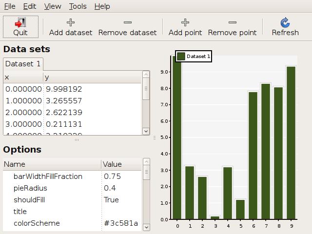

.. index:: chavier, gui
.. _chavier:

*******
Chavier
*******

Chavier is a GUI application that let's you explore PyCha. It can be launched
from the command line with ``chavier``.

The easiest way to get started is to generate some random data to play around with.

    ``Tools -> Generate random points``
    
The type of chart can be changed in the ``View`` menu. To change an option, just
double click its entry or use the ``Edit`` menu.

``Tools -> Dump chart state`` prints some chart information (size, ranges, etc.)
to the console from which Chavier was launched.

::

    CHART STATE
    ----------------------------------------------------------------------
    surface: 320 x 396
    area   : <pycha.chart.Area@(30.00, 30.00) 260.00 x 336.00 Origin: 0.00>

    minxval: 0.0
    maxxval: 9.0
    xrange : 9.0

    minyval: 0.0
    maxyval: 9.8384503533
    yrange : 9.8384503533

