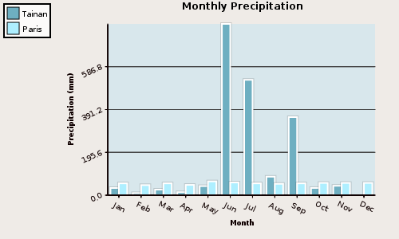
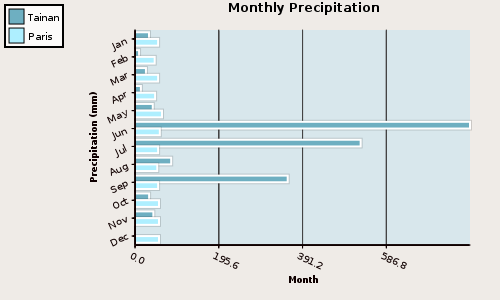

.. index:: examples
.. _examples:

********
Examples
********

The most common use cases of PyCha are saving the chart to a file and embedding
the chart in an application.

.. index:: save chart as png
.. _save-chart-to-file:

Ex1: Save Chart to File
=======================

The files for this examples are `precip.py <examples/precip.py>`_ and `barchart.py 
<examples/barchart.py>`_.

precip.py

::

    Tainan = (
        ('Jan', 32.7),
        ('Feb', 9.5),
        ('Mar', 25.5),
        ('Apr', 13.7),
        ('May', 41.5),
        ('Jun', 782.2),
        ('Jul', 526.9),
        ('Aug', 84.5),
        ('Sep', 356.5),
        ('Oct', 33.0),
        ('Nov', 42.9),
        ('Dec', 1.1),
    )

    Paris = (
        ('Jan', 54),
        ('Feb', 46),
        ('Mar', 54),
        ('Apr', 47),
        ('May', 63),
        ('Jun', 58),
        ('Jul', 54),
        ('Aug', 52),
        ('Sep', 54),
        ('Oct', 56),
        ('Nov', 56),
        ('Dec', 56),
    )

barchart.py

::

    import sys

    import cairo

    import pycha.bar

    import precip

    def barChart(output, chartFactory):
        surface = cairo.ImageSurface(cairo.FORMAT_ARGB32, 500, 300)

        dataSet = (
            ('Tainan', [(i, l[1]) for i, l in enumerate(precip.Tainan)]),
            ('Paris', [(i, l[1]) for i, l in enumerate(precip.Paris)]),
            )

        options = {
            'axis': {
                'x': {
                    'ticks': [dict(v=i, label=l[0]) for i, l in enumerate(precip.Tainan)],
                    'label': 'Month',
                    'rotate': 25,
                },
                'y': {
                    'tickCount': 4,
                    'rotate': 25,
                    'label': 'Precipitation (mm)'
                }
            },
            'background': {
                'chartColor': '#d8e7ec',
                'baseColor': '#efebe7',
                'lineColor': '#444444'
            },
            'colorScheme': '#6eafc1',
            'legend': {
                'hide': False,
                'position': {'top': 5, 'left': 5},
            },
            'padding': {
                'left': 135,
                'bottom': 55,
            },
            'title': 'Monthly Precipitation'
        }
        chart = chartFactory(surface, options)

        chart.addDataset(dataSet)
        chart.render()

        surface.write_to_png(output)

    if __name__ == '__main__':
        if len(sys.argv) > 1:
            output = sys.argv[1]
        else:
            output = 'barchart.png'
        barChart('v' + output, pycha.bar.VerticalBarChart)
        barChart('h' + output, pycha.bar.HorizontalBarChart)
        
Let's say we want to graph the monthly precipitations of Tainan, Taiwan, and
Paris, France. We can store the data in a Python file called ``precip.py`` so that 
we can refer to it as ``precip.Tainan`` and ``precip.Paris``. 

In ``barchart.py``, we first import the necessary modules.

Our program supports a commandline argument for the file name::

    import sys

PyCha depends on Cairo::

    import cairo

We want a bar chart::

    import pycha.bar

We need our data::

    import precip

We next define a class called barChart that takes in the output filename and the
:ref:`chart type <pycha-chart-types>`::

    def barChart(output, chartFactory):

Our data needs to be formatted for PyCha::

    dataSet = (
            ('Tainan', [(i, l[1]) for i, l in enumerate(precip.Tainan)]),
            ('Paris', [(i, l[1]) for i, l in enumerate(precip.Paris)]),
            )
            
We next set our options::

    options = {
        'axis': {
            'x': {
                'ticks': [dict(v=i, label=l[0]) for i, l in enumerate(precip.Tainan)],
                'label': 'Month',
                'rotate': 25,
            },
            'y': {
                'tickCount': 4,
                'rotate': 25,
                'label': 'Precipitation (mm)'
            }
        },
        'background': {
            'chartColor': '#d8e7ec',
            'baseColor': '#efebe7',
            'lineColor': '#444444'
        },
        'colorScheme': '#6eafc1',
        'legend': {
            'hide': False,
            'position': {'top': 5, 'left': 5},
        },
        'padding': {
            'left': 135,
            'bottom': 55,
        },
        'title': 'Monthly Precipitation'
    }

Notice that the :ref:`axis:x:ticks option <xticks>` sets the labels for the 
x-axis ticks.

The legend is hidden by default, so we unhide it. The ``legend:position`` option is
used to place the legend in the desired location.

We now create the chart and render it::

    chart = chartFactory(surface, options)

    chart.addDataset(dataSet)
    chart.render()
    
The final step is to save the chart as a png image file::

    surface.write_to_png(output)

We initiate the program with::

    if __name__ == '__main__':
        if len(sys.argv) > 1:
            output = sys.argv[1]
        else:
            output = 'barchart.png'
        barChart('v' + output, pycha.bar.VerticalBarChart)
        barChart('h' + output, pycha.bar.HorizontalBarChart)
        
Running the program from the command line with:

``python barchart.py``

produces the beautiful charts shown below.

Vertical bar chart:

Horizontal bar chart:

Reason for all the rain in the summer in Tainan? Typhoons.

.. index:: embed chart in GTK app
.. _embed-chart-in-gtk-app:

Ex2: Embed Chart in GTK App
===========================

Coming soon. Please refer to ``Chavier`` in the source tree for an example.

