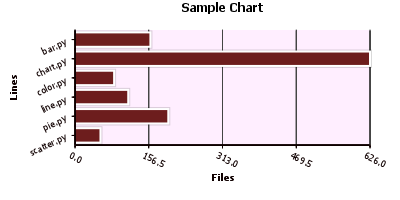
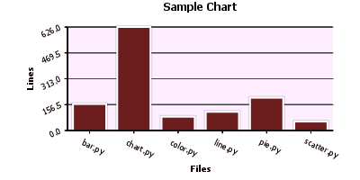
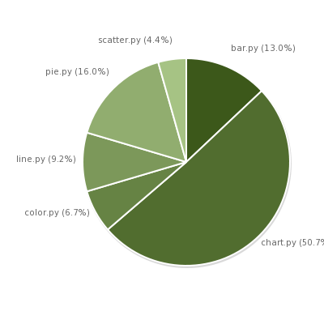
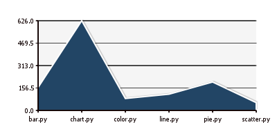
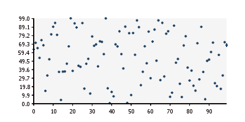

.. index:: introduction
.. _introduction:

************
Introduction
************

PyCha is a very simple `Python <http://www.python.org>`_ package for drawing 
charts using the `Cairo <http://www.cairographics.org/>`_ library. Its lead
developer is Lorenzo Gil Sanchez.

.. index:: pycha goals

PyCha aims to be:

    * Lightweight
    * Simple to use
    * Nice looking with default values
    * Customizable

.. index:: chart types
.. _pycha-chart-types:
    
The following charts are currently supported (see screenshots below):

    * horizontal bar charts (``pycha.bar.HorizontalBarChart``)
    * vertical bar charts (``pycha.bar.VerticalBarChart``)
    * pie charts (``pycha.pie.PieChart``)
    * line charts (``pycha.line.LineChart``)
    * scatter charts (``pycha.scatter.ScatterChart``)
  
Support for stacked bar charts is planned for a future release. 
    
PyCha is distributed under the terms of the `GNU Lesser General Public License
<http://www.gnu.org/licenses/lgpl.html>`_. 

If you require more advanced graphs, you might want to consider `matplotlib 
<http://matplotlib.sourceforge.net/>`_.

.. index:: screenshots   
.. _screenshots:
    
Screenshots
===========

- **horizontal bar chart**

- **vertical bar chart**

- **pie chart**

- **line chart**

- **scatter chart**

.. index:: output formats
.. _output-formats:

Output Formats
==============

PyCha uses the `Cairo <http://www.cairographics.org/>`_ library so it should support
all `Cairo surfaces <http://www.cairographics.org/manual/cairo-surfaces.html>`_.

Please refer to :ref:`save-chart-to-file` and :ref:`embed-chart-in-gtk-app` for
examples.

.. _get-involved:

Get Involved
============

PyCha has a mailing list at `http://groups.google.com/group/pycha
<http://groups.google.com/group/pycha>`_. Questions and ideas are welcome.

